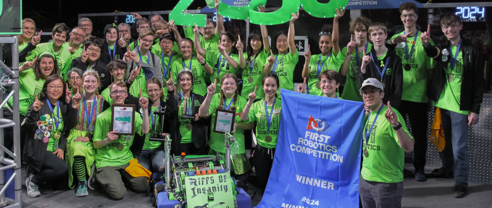
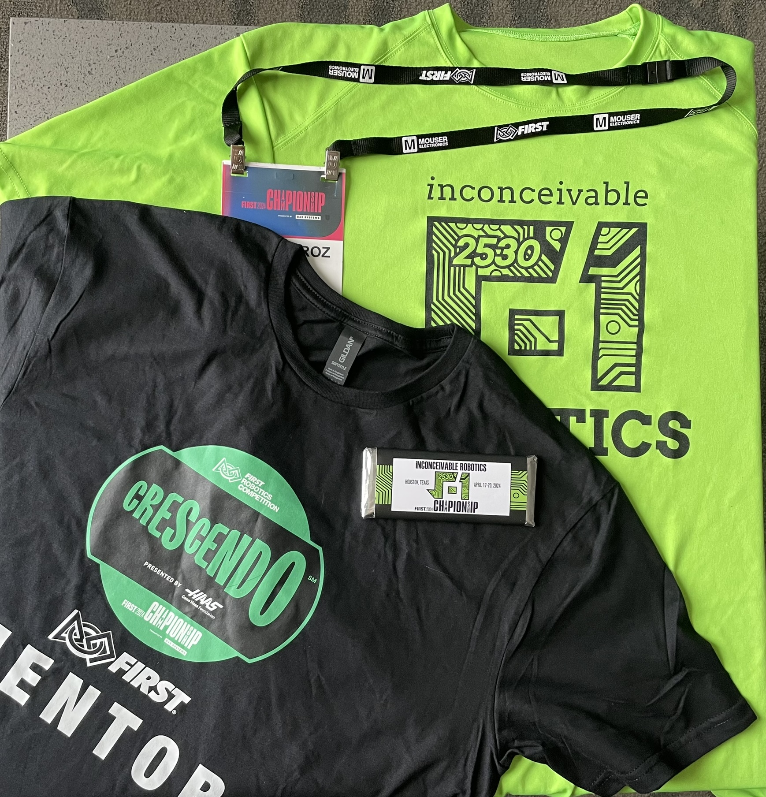
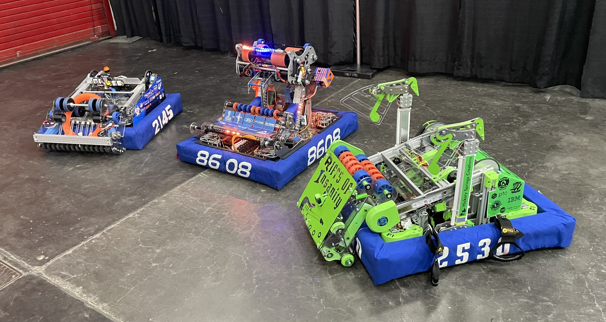

# RobotCode2024: Riffs of Insanity

This repository holds the robot code for Riffs of Insanity, the robot that took us to the world championships.

## Photos

## Items of interest

| Item | Link | Description |
| ---- | ---- | ----------- |
| Auto routes | [link](https://github.com/Team2530/RobotCode2024/tree/main/src/main/deploy/pathplanner) | Contains the [pathplanner](https://pathplanner.dev/) routes used to guide our robot through the 15 seconds of autonomous mode. |
| Robot Container | [link](https://github.com/Team2530/RobotCode2024/blob/main/src/main/java/frc/robot/RobotContainer.java) | The most important class file in the project. Contains references to most other important systems. |
| Drivetrain | [link](https://github.com/Team2530/RobotCode2024/blob/main/src/main/java/frc/robot/subsystems/SwerveSubsystem.java) | Controls the drive train of the robot. |
| Intake | [link](https://github.com/Team2530/RobotCode2024/blob/main/src/main/java/frc/robot/subsystems/Intake.java) | The intake subsystem. |
| LED Code | [link](https://github.com/Team2530/RobotCode2024/blob/main/src/main/java/frc/robot/subsystems/LEDstripOne.java) | Controls the robot LEDs. |
